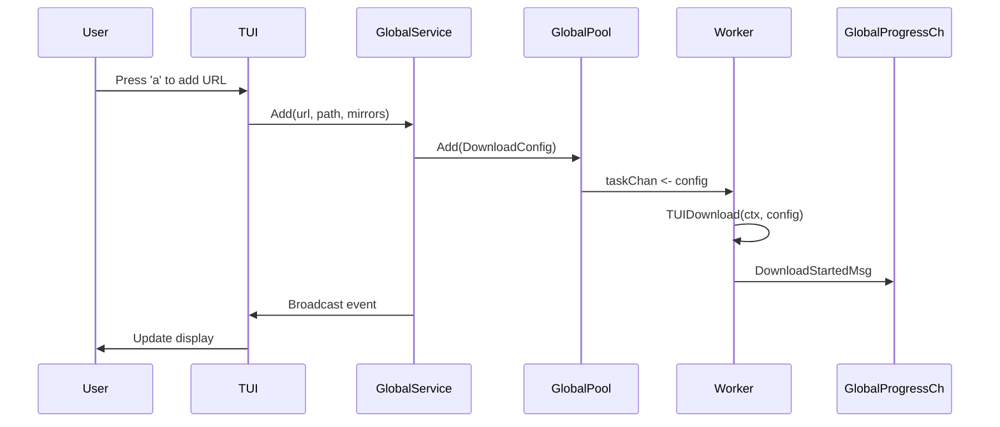

Surge is built on a **daemon architecture** that enables multiple terminal instances, browser extensions, and API clients to share a single, efficient download engine.

## Overview

The architecture consists of three primary layers:

1. **Client Layer** - TUI, CLI commands, browser extensions, HTTP API clients
2. **Service Layer** - Download orchestration, event streaming, state management  
3. **Engine Layer** - Worker pools, concurrent downloaders, file I/O

<Note>
Surge runs **one background engine per machine**. All clients connect to this shared daemon, ensuring downloads continue even when you close the TUI.
</Note>

## Core Components

The daemon is composed of several global components initialized at startup:

### GlobalPool (WorkerPool)

Manages concurrent downloads with configurable slots (default: 3).

```go
// Located in: cmd/root.go:47-50
var (
    GlobalPool              *download.WorkerPool
    GlobalProgressCh        chan any
    GlobalService           core.DownloadService
    serverProgram           *tea.Program
)
```

**Responsibilities:**
- Queue management (up to 100 buffered tasks)
- Worker allocation (spawns N goroutines)
- Pause/Resume/Cancel operations
- Graceful shutdown with state persistence

**Key Methods:**
- `Add(cfg types.DownloadConfig)` - Queues a new download
- `Pause(downloadID string)` - Pauses active download and saves state
- `Resume(downloadID string)` - Hot-resumes from saved `.surge` file
- `GracefulShutdown()` - Pauses all downloads before exit

<Accordion title="WorkerPool Implementation Details">
The WorkerPool maintains two maps:

```go
type WorkerPool struct {
    taskChan     chan types.DownloadConfig
    downloads    map[string]*activeDownload  // Active downloads
    queued       map[string]types.DownloadConfig  // Pending queue
    maxDownloads int  // Concurrent download limit
}
```

Each worker goroutine continuously pulls from `taskChan` and invokes `TUIDownload()` with cancellable contexts.
</Accordion>

### GlobalService (LocalDownloadService)

Provides a unified API for all download operations and event streaming.

```go
// Located in: internal/core/local_service.go:44-65
type LocalDownloadService struct {
    Pool         *download.WorkerPool
    InputCh      chan interface{}
    listeners    []chan interface{}  // Event broadcast
    reportTicker *time.Ticker        // 150ms progress updates
}
```

**Event Types:**
- `DownloadStartedMsg` - File metadata resolved
- `DownloadProgressMsg` - Speed/bytes/ETA updates (150ms interval)
- `DownloadCompleteMsg` - Success with elapsed time
- `DownloadErrorMsg` - Failure with error details
- `DownloadPausedMsg` / `DownloadResumedMsg`
- `DownloadQueuedMsg` / `DownloadRemovedMsg`

<Info>
All TUI instances, the HTTP server, and headless consumers receive the same event stream via `StreamEvents()`. This enables real-time sync across multiple terminals.
</Info>

### GlobalProgressCh (Event Channel)

A buffered channel (capacity: 100) that workers use to publish events.

```go
// Workers push events
progressCh <- events.DownloadStartedMsg{
    DownloadID: cfg.ID,
    Filename:   finalFilename,
    Total:      probe.FileSize,
}

// Service broadcasts to all listeners
for msg := range progressCh {
    s.broadcast(msg)
}
```

## Communication Flow

### TUI Mode (Interactive)



<Tip>
The TUI uses Bubble Tea's `tea.Cmd` system. Events from `GlobalService.StreamEvents()` are converted to Bubble Tea messages via `p.Send(msg)`.
</Tip>

### Server Mode (Headless)

In server mode, Surge runs without a TUI:

```bash
surge server https://example.com/file.zip
```

**Architecture changes:**
- HTTP server binds to `0.0.0.0:1700` (configurable)
- Events stream to stdout instead of TUI
- Browser extension sends downloads via POST `/download`
- Token-based authentication (Bearer token)

```go
// Located in: cmd/root.go:256-318
func StartHeadlessConsumer() {
    stream, cleanup, _ := GlobalService.StreamEvents(context.Background())
    for msg := range stream {
        switch m := msg.(type) {
        case events.DownloadCompleteMsg:
            fmt.Printf("Completed: %s [%s]\n", m.Filename, m.DownloadID[:8])
        }
    }
}
```

### Remote TUI Mode (Connect)

Connect to a remote daemon:

```bash
surge connect 192.168.1.10:1700 --token abc123
```

**Architecture:**
- TUI sends HTTP requests instead of calling `GlobalService` directly
- Uses `RemoteDownloadService` wrapper
- WebSocket or polling for event streaming

<CardGroup cols={2}>
<Card title="Local Architecture" icon="server">
**Direct Access**
- TUI → GlobalService (in-process)
- Zero latency
- Shared memory state
</Card>

<Card title="Remote Architecture" icon="network-wired">
**HTTP API**
- TUI → HTTP Client → Server
- Network latency
- REST + SSE/WebSocket
</Card>
</CardGroup>

## Download Engine

Each download is handled by either:

### Single-Threaded Downloader

Used when:
- Server doesn't support range requests (`Accept-Ranges: none`)
- File size is unknown (`Content-Length` missing)

**Flow:**
1. Probe server with HEAD request
2. Open single GET connection
3. Stream to file with progress reporting

### Concurrent Downloader

Used when:
- Server supports range requests (`Accept-Ranges: bytes`)
- File size is known

**Flow:**
1. Calculate optimal connections (square root heuristic)
2. Split file into large chunks (fileSize / numWorkers)
3. Spawn N workers, each downloading a chunk
4. Workers write to file using `WriteAt()` (thread-safe)
5. Progress aggregated via atomic counters

```go
// Located in: internal/engine/concurrent/downloader.go:62-97
func (d *ConcurrentDownloader) getInitialConnections(fileSize int64) int {
    sizeMB := float64(fileSize) / (1024 * 1024)
    calculatedWorkers := int(math.Round(math.Sqrt(sizeMB)))  // Square root heuristic
    
    // Clamp to 1-32 connections
    if calculatedWorkers < 1 { return 1 }
    if calculatedWorkers > maxConns { return maxConns }
    
    return calculatedWorkers
}
```

<Info>
For a 100 MB file: √100 = 10 connections  
For a 1 GB file: √1024 ≈ 32 connections (capped at max)
</Info>

## State Persistence

Surge uses two persistence layers:

### 1. Master Download List (SQLite)

Located at `~/.local/state/surge/surge.db` (Linux) or `~/Library/Application Support/surge/surge.db` (macOS).

**Stores:**
- Download history (completed/error/queued)
- Metadata (URL, filename, size, speed)
- User-initiated pauses

### 2. Resume State Files (.surge)

Located alongside incomplete downloads (e.g., `file.zip.surge`).

**Stores:**
- Remaining byte ranges (task queue)
- Downloaded byte count
- Chunk bitmap (visual representation)
- Mirror list
- Elapsed time

```go
// Located in: internal/engine/concurrent/downloader.go:575-587
type DownloadState struct {
    URL             string
    TotalSize       int64
    Downloaded      int64
    Tasks           []types.Task  // Remaining work
    ChunkBitmap     []byte        // Completion visualization
    Mirrors         []string      // Active mirrors
    Elapsed         int64         // Nanoseconds
}
```

<Tip>
Deleting the `.surge` file forces Surge to restart the download from scratch, but won't affect the master list in SQLite.
</Tip>

## HTTP API

The daemon exposes a REST API on port 1700 (auto-increment if busy).

**Key Endpoints:**
- `POST /download` - Add new download
- `GET /download?id=<uuid>` - Query status
- `POST /pause/<id>` - Pause download
- `POST /resume/<id>` - Resume download
- `DELETE /download/<id>` - Cancel and remove
- `GET /downloads` - List all downloads

**Authentication:**
```bash
curl -H "Authorization: Bearer $(surge token)" \
  http://localhost:1700/downloads
```

<Note>
The browser extension uses this API to send intercepted downloads. If ExtensionPrompt is enabled in settings, downloads require TUI confirmation.
</Note>

## Locking and Concurrency

Surge prevents multiple instances from running simultaneously:

```go
// Located in: cmd/root.go:90-105
isMaster, err := AcquireLock()
if !isMaster {
    fmt.Fprintln(os.Stderr, "Error: Surge is already running.")
    fmt.Fprintln(os.Stderr, "Use 'surge add <url>' to add to the active instance.")
    os.Exit(1)
}
```

**Lock file location:**
- Linux: `/run/user/<uid>/surge/surge.lock`
- macOS: `~/Library/Caches/surge/surge.lock`
- Windows: `%LOCALAPPDATA%\surge\surge.lock`

## Summary

<CardGroup cols={2}>
<Card title="Single Engine" icon="microchip">
One `GlobalPool` manages all downloads across all clients
</Card>

<Card title="Event-Driven" icon="bolt">
`GlobalProgressCh` streams events to TUI, API, and logs
</Card>

<Card title="Persistent" icon="database">
SQLite + `.surge` files enable seamless resume
</Card>

<Card title="Multi-Client" icon="users">
TUI, CLI, browser extension, and API share the same backend
</Card>
</CardGroup>