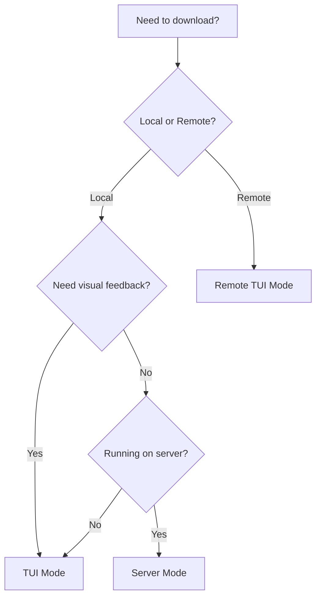

Surge operates in three distinct modes, each optimized for different use cases. All modes share the same powerful download engine.

## TUI Mode (Interactive)

The default mode provides a beautiful terminal user interface for managing downloads.

### Starting TUI Mode

```bash
# Launch interactive dashboard
surge

# Start with URLs pre-queued
surge https://example.com/file1.zip https://example.com/file2.zip

# Combine URLs and batch file
surge https://example.com/file.zip --batch urls.txt
```

<Info>
The TUI uses [Bubble Tea](https://github.com/charmbracelet/bubbletea) for the interactive interface and [Lipgloss](https://github.com/charmbracelet/lipgloss) for styling.
</Info>

### Features

**Real-Time Visualization:**
- Live progress bars with chunk visualization
- Speed graphs (current and average)
- ETA calculations
- Active worker count

**Keyboard Controls:**
- `a` - Add new download
- `p` - Pause/Resume selected download
- `d` - Delete selected download
- `q` - Quit (downloads continue in background)
- `↑/↓` - Navigate downloads
- `tab` - Switch between views

**Multi-Tab Interface:**
- **Active** - Currently downloading
- **Completed** - Finished downloads
- **Queued** - Pending downloads
- **Settings** - Configuration panel

<Tip>
Press `ctrl+p` while in the TUI to see all available actions and shortcuts.
</Tip>

### Architecture

```go
// Located in: cmd/root.go:172-250
func startTUI(port int, exitWhenDone bool, noResume bool) {
    m := tui.InitialRootModel(port, Version, GlobalService, noResume)
    p := tea.NewProgram(m, tea.WithAltScreen())
    serverProgram = p  // Save for HTTP handler
    
    // Stream events from engine to TUI
    stream, cleanup, _ := GlobalService.StreamEvents(context.Background())
    go func() {
        for msg := range stream {
            p.Send(msg)  // Convert to Bubble Tea message
        }
    }()
    
    p.Run()
}
```

**Communication Flow:**
1. User presses key → Bubble Tea `Update(msg)` 
2. TUI calls `GlobalService.Add(url, path, mirrors)`
3. Service queues to `GlobalPool`
4. Worker emits progress → `GlobalProgressCh`
5. Service broadcasts → TUI receives via `p.Send(msg)`
6. TUI re-renders with new data

<Note>
TUI mode also starts an HTTP server in the background on port 1700. This allows the browser extension to send downloads even when using the interactive interface.
</Note>

### When to Use TUI Mode

<CardGroup cols={2}>
<Card title="Development" icon="code">
Quickly test downloads and see detailed progress visualization
</Card>

<Card title="Manual Management" icon="hand">
Interactively pause, resume, and monitor multiple downloads
</Card>

<Card title="Local Machine" icon="laptop">
You're sitting at the computer and want visual feedback
</Card>

<Card title="Learning" icon="graduation-cap">
Explore Surge's features and settings interactively
</Card>
</CardGroup>

---

## Server Mode (Headless)

Runs Surge as a background daemon without a user interface. Perfect for servers, Raspberry Pis, or automation.

### Starting Server Mode

```bash
# Start headless daemon
surge server

# Start with initial download
surge server https://example.com/large-file.zip

# Specify custom port
surge server --port 8080

# Provide explicit API token
surge server --token my-secret-token
```

<Info>
Server mode binds to `0.0.0.0` (all interfaces) by default. This makes it accessible via `localhost` and your local network IP.
</Info>

### Features

**HTTP API:**
- REST endpoints for all operations
- Token-based authentication
- CORS enabled for browser extensions

**Headless Logging:**
- Download events printed to stdout
- Structured logs with download IDs
- No interactive interface overhead

**Persistent Operation:**
- Runs in background (use `nohup` or systemd)
- Survives SSH disconnections
- Auto-resumes paused downloads on restart

### Authentication

Server mode requires a bearer token for API access:

```bash
# Generate/view token
surge token

# Use token in API requests
curl -H "Authorization: Bearer $(surge token)" \
  http://localhost:1700/downloads
```

**Token Storage:**
- Linux: `~/.local/state/surge/token`
- macOS: `~/Library/Application Support/surge/token`
- Windows: `%LOCALAPPDATA%\surge\token`

<Note>
If you lose the token, delete the token file and restart Surge. A new token will be auto-generated.
</Note>

### Headless Output

```bash
$ surge server https://releases.ubuntu.com/22.04/ubuntu-22.04.3-desktop-amd64.iso
Started: ubuntu-22.04.3-desktop-amd64.iso [a1b2c3d4]
Completed: ubuntu-22.04.3-desktop-amd64.iso [a1b2c3d4] (in 2m34s)
```

**Event Format:**
```go
// Located in: cmd/root.go:270-316
switch m := msg.(type) {
case events.DownloadStartedMsg:
    fmt.Printf("Started: %s [%s]\n", m.Filename, id[:8])
case events.DownloadCompleteMsg:
    fmt.Printf("Completed: %s [%s] (in %s)\n", m.Filename, id[:8], m.Elapsed)
case events.DownloadErrorMsg:
    fmt.Printf("Error: %s [%s]: %v\n", m.Filename, id[:8], m.Err)
}
```

### CLI Commands (While Server Running)

Control the headless daemon from another terminal:

```bash
# Add download to running server
surge add https://example.com/file.zip

# List all downloads
surge ls

# Pause specific download
surge pause <download-id>

# Resume download
surge resume <download-id>

# Remove download
surge rm <download-id>
```

<Tip>
These commands automatically detect the running server on port 1700 and use the saved token for authentication.
</Tip>

### Docker Deployment

Run Surge server in a Docker container:

```bash
# Download compose file
wget https://raw.githubusercontent.com/surge-downloader/surge/refs/heads/main/docker/compose.yml

# Start container
docker compose up -d

# Get API token
docker compose exec surge surge token

# Check downloads
docker compose exec surge surge ls
```

**Volume Mounts:**
- `/downloads` - Download destination
- `/config` - Surge configuration and state

### When to Use Server Mode

<CardGroup cols={2}>
<Card title="Servers" icon="server">
Run on headless Linux servers without X11/GUI
</Card>

<Card title="Automation" icon="robot">
Integrate with scripts, cron jobs, or orchestration tools
</Card>

<Card title="Remote Access" icon="globe">
Access downloads from anywhere via HTTP API
</Card>

<Card title="Low Resources" icon="microchip">
Minimal memory/CPU usage without TUI rendering
</Card>
</CardGroup>

---

## Remote TUI Mode (Connect)

Connect a TUI to a remote Surge server. Provides the interactive interface while downloads run on a different machine.

### Connecting to Remote Server

```bash
# Auto-detect local server
surge connect

# Connect to specific host
surge connect 192.168.1.10:1700 --token <token>

# Connect to public server (uses HTTPS)
surge connect surge.example.com:1700 --token <token>

# Alternative syntax (global flags)
surge --host 192.168.1.10:1700 --token <token>
```

<Info>
Surge automatically uses `http://` for loopback/private IPs and `https://` for public/hostname targets.
</Info>

### Architecture

```go
// Located in: cmd/connect.go
func connectAndRunTUI(cmd *cobra.Command, hostTarget string) {
    // Create remote service wrapper
    remoteService := core.NewRemoteDownloadService(hostTarget, token)
    
    // Initialize TUI with remote backend
    m := tui.InitialRootModel(port, Version, remoteService, noResume)
    m.IsRemote = true
    
    // Stream events via HTTP
    stream, cleanup, _ := remoteService.StreamEvents(context.Background())
    go func() {
        for msg := range stream {
            p.Send(msg)
        }
    }()
}
```

**Key Differences from Local TUI:**
- Commands sent via HTTP POST instead of direct function calls
- Events streamed via Server-Sent Events (SSE) or polling
- Network latency affects responsiveness
- Uses `RemoteDownloadService` wrapper instead of `LocalDownloadService`

### Environment Variables

Avoid typing host/token repeatedly:

```bash
# Set in shell profile
export SURGE_HOST=192.168.1.10:1700
export SURGE_TOKEN=abc123-def456-ghi789

# Now just run
surge connect
```

### When to Use Remote TUI

<CardGroup cols={2}>
<Card title="NAS/Home Server" icon="hard-drive">
Downloads run on NAS, control from laptop
</Card>

<Card title="Cloud VM" icon="cloud">
Manage downloads on AWS/GCP from local terminal
</Card>

<Card title="SSH Alternative" icon="terminal">
Use local TUI instead of SSH + screen/tmux
</Card>

<Card title="Multiple Clients" icon="users">
Multiple developers controlling shared download server
</Card>
</CardGroup>

---

## Mode Comparison

| Feature | TUI Mode | Server Mode | Remote TUI |
|---------|----------|-------------|------------|
| **Visual Interface** | ✅ Yes | ❌ No | ✅ Yes |
| **HTTP API** | ✅ Yes (background) | ✅ Yes | ✅ Yes (client) |
| **Headless** | ❌ No | ✅ Yes | ❌ No |
| **Remote Control** | Via API | Via API/CLI | Native |
| **Resource Usage** | Medium | Low | Low (server) + Medium (client) |
| **Auto-Resume** | ✅ Yes | ✅ Yes | ✅ Yes |
| **Browser Extension** | ✅ Yes | ✅ Yes | ✅ Yes (server-side) |
| **Event Streaming** | In-process | Stdout | HTTP SSE/polling |

<Accordion title="Can I switch between modes?">
Yes! You can:

1. **Start in TUI, quit, resume in Server:**
   ```bash
   surge              # Start TUI
   # Press 'q' to quit
   surge server       # Resume in headless mode
   ```

2. **Start in Server, connect with Remote TUI:**
   ```bash
   surge server       # On server machine
   surge connect      # On client machine
   ```

3. **Use CLI commands with any mode:**
   ```bash
   surge server &     # Background server
   surge add URL      # Add via CLI
   surge ls           # Check status
   ```

Downloads persist across mode changes because they're managed by the shared `GlobalPool` and SQLite database.
</Accordion>

## Choosing the Right Mode



<Tip>
For most users, **TUI Mode** is the best starting point. Once you're comfortable, explore Server Mode for automation and Remote TUI for managing downloads on other machines.
</Tip>